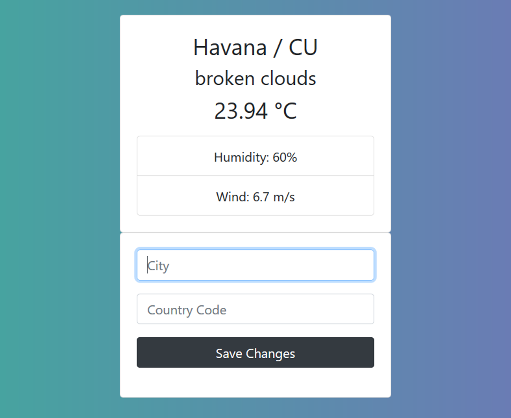
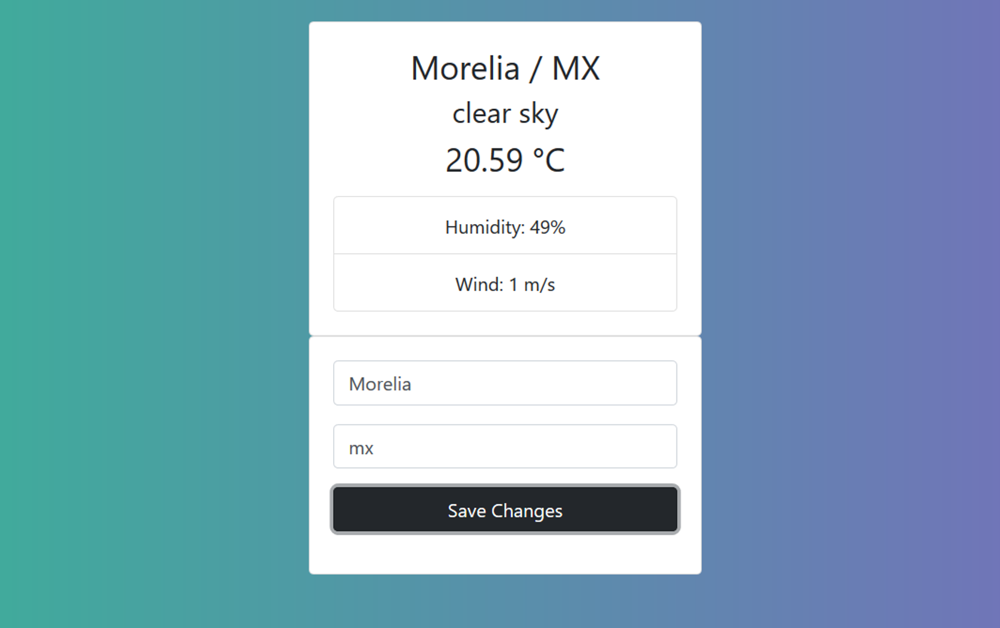

## Weather application that you can enter the data of the city you want and returns the values ​​of that city by making a request to the weathermap.org server.

#### Functions:
* Make requests to the weathermap api.
* Made entirely in javascript.
* Use of async, await.
* LocalStorage.
* Nodejs server.

**Screenshot 1**

**Screenshot 2**
